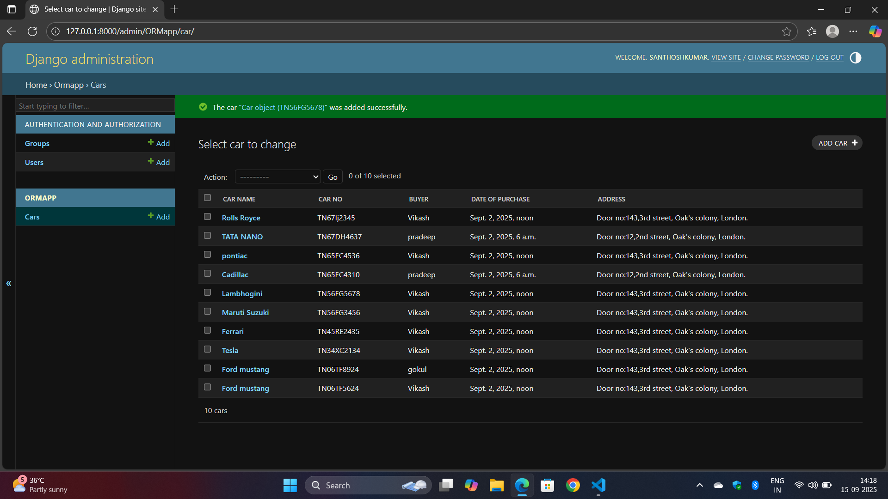

# Ex02 Django ORM Web Application
## Date: 15.9.2025

## AIM
To develop a Django application to store and retrieve data from a Car Inventory Database using Object Relational Mapping(ORM).

## ENTITY RELATIONSHIP DIAGRAM


## DESIGN STEPS

### STEP 1:
Clone the problem from GitHub

### STEP 2:
Create a new app in Django project

### STEP 3:
Enter the code for admin.py and models.py

### STEP 4:
Execute Django admin and create details for 10 books

## PROGRAM
```
models.py

from django.db import models
from django.contrib import admin
class Car(models.Model):
    car_name=models.CharField(max_length=20)
    car_no=models.CharField(primary_key=True,max_length=10)
    buyer=models.CharField(max_length=20)
    date_of_purchase=models.DateTimeField()
    Address=models.CharField(max_length=100)

class CarAdmin(admin.ModelAdmin):
    list_display=['car_name','car_no','buyer','date_of_purchase','Address']

admin.py

from django.contrib import admin
from .models import Car,CarAdmin
admin.site.register(Car,CarAdmin)

```


## OUTPUT



## RESULT
Thus the program for creating car inventory database database using ORM hass been executed successfully
